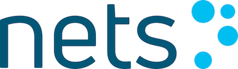
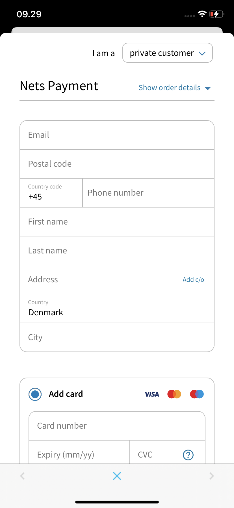

# MiA - EASY iOS SDK v1.2.0



## Getting started

MiA - Easy iOS SDK is a library which facilitates the integration of the Easy Re-direct Checkout in your iOS application.

Additional resources:

* **Nets Easy technical documentation** can be found [here](https://tech.dibspayment.com/easy).
* **Nets Easy API documentation** can be found [here](https://tech.dibspayment.com/easy/api).
* **Nets Easy checkout guide (Re-direct)** can be found [here](https://tech.dibspayment.com/node4555edit/checkout-introduction).
* **Easy - Android SDK** can be found [here](https://github.com/DIBS-Payment-Services/Easy-Android-SDK).


## Sample Project

|  |  |  |
| --- | --- | --- |

We have provided a sample project, MiaSample, in the repository which is written in Swift 4.2 and it demonstrates MiA EASY SDK usage and capabilities. To use it, download the repo, run **pod install** to download the required libraries and open **MiaSample.xcworkspace**. After that, navigate to **Constant.swift** to add your provided information from Easy platform.

## Requirements
* MiA iOS SDK requires iOS 9 or above.

## Installation

### Carthage
* Add the following line to your Cartfile
```
github "DIBS-Payment-Services/Easy-iOS-SDK"
```

* Run `carthage update` to get Mia SDK
* Navigate to Carthage/Builds/iOS for `Mia.framework`
* In your project **TARGET**, navigate to **GENERAL**
* Drag and drop `Mia.framework` to **Embedded Binaries**
* In any file you'd like to use Mia in, do not forget to import the framework with `import Mia`

### Manual
* Download/clone this https://github.com/DIBS-Payment-Services/Easy-iOS-SDK.git to get Mia.framework
* In your project **TARGET**, navigate to **GENERAL**
* Drag and drop `Mia.framework` to **Embedded Binaries**
* In any file you'd like to use Mia in, do not forget to import the framework with `import Mia`

## High level architecture of the Easy SDK
The below picture illustrates the SDK and its interactions with the macro components of the integration’s environment.


## Usage
After setup is ready, using MiA SDK is easy. Initialize and present Mia SDK's checkout controller providing actions for success, cancelation and failure block parameters. The SDK will display a checkout WebView and invoke the action blocks accordingly. For full references, please refer to **Documentation** folder.

```swift
let miaCheckoutController = MiaSDK.checkoutControllerForPayment(
    withID: paymentID,
    paymentURL: paymentURL,
    isEasyHostedWithRedirectURL: easyHostedRedirectURL,
    success: { controller in /* handle success */ },
    cancellation: { controller in /* handle cancellation */ },
    failure: { controller, error in /* handle failure */ }
)

present(miaCheckoutController, animated: true)
```

## Integration - Run Script

To assist integration of `Mia.framework` in your project, navigate to the project's target (under TARGETS) in Xcode and add the following _Run Script_ in _Build Phases_ section. If you want to avoid the error when running on simulator, please also check the box for this. Note: Run script only when installing!

```
APP_PATH="${TARGET_BUILD_DIR}/${WRAPPER_NAME}"

# This script loops through the frameworks embedded in the application and
# removes unused architectures.
find "$APP_PATH" -name 'Mia.framework' -type d | while read -r FRAMEWORK
do
FRAMEWORK_EXECUTABLE_NAME=$(defaults read "$FRAMEWORK/Info.plist" CFBundleExecutable)
FRAMEWORK_EXECUTABLE_PATH="$FRAMEWORK/$FRAMEWORK_EXECUTABLE_NAME"
echo "Executable is $FRAMEWORK_EXECUTABLE_PATH"

EXTRACTED_ARCHS=()

for ARCH in $ARCHS
do
echo "Extracting $ARCH from $FRAMEWORK_EXECUTABLE_NAME"
lipo -extract "$ARCH" "$FRAMEWORK_EXECUTABLE_PATH" -o "$FRAMEWORK_EXECUTABLE_PATH-$ARCH"
EXTRACTED_ARCHS+=("$FRAMEWORK_EXECUTABLE_PATH-$ARCH")
done

echo "Merging extracted architectures: ${ARCHS}"
lipo -o "$FRAMEWORK_EXECUTABLE_PATH-merged" -create "${EXTRACTED_ARCHS[@]}"
rm "${EXTRACTED_ARCHS[@]}"

echo "Replacing original executable with thinned version"
rm "$FRAMEWORK_EXECUTABLE_PATH"
mv "$FRAMEWORK_EXECUTABLE_PATH-merged" "$FRAMEWORK_EXECUTABLE_PATH"

done
```

## Contact
If you have any question or feedback, please contact us via email: mobile-acceptance@nets.eu.

License
----
*****Copyright (c) 2020 Nets Denmark A/S*****


NETS DENMARK A/S, ("NETS"), FOR AND ON BEHALF OF ITSELF AND ITS SUBSIDIARIES AND AFFILIATES UNDER COMMON CONTROL, IS WILLING TO LICENSE THE SOFTWARE TO YOU ONLY UPON THE CONDITION THAT YOU ACCEPT ALL OF THE TERMS CONTAINED IN THIS BINARY CODE LICENSE AGREEMENT. BY USING THE SOFTWARE YOU ACKNOWLEDGE THAT YOU HAVE READ THE TERMS AND AGREE TO THEM. IF YOU ARE AGREEING TO THESE TERMS ON BEHALF OF A COMPANY OR OTHER LEGAL ENTITY, YOU REPRESENT THAT YOU HAVE THE LEGAL AUTHORITY TO BIND THE LEGAL ENTITY TO THESE TERMS. IF YOU DO NOT HAVE SUCH AUTHORITY, OR IF YOU DO NOT WISH TO BE BOUND BY THE TERMS, YOU MUST NOT USE THE SOFTWARE ON THIS SITE OR ANY OTHER MEDIA ON WHICH THE SOFTWARE IS CONTAINED.

Software is copyrighted. Title to Software and all associated intellectual property rights is retained by NETS and/or its licensors. Unless enforcement is prohibited by applicable law, you may not modify, decompile, or reverse engineer Software.

No right, title or interest in or to any trademark, service mark, logo or trade name of NETS or its licensors is granted under this Agreement.

Permission is hereby granted, to any person obtaining a copy of this software and associated documentation files (the Software"), to deal in the Software, including without limitation the rights to use, copy, publish, distribute, sublicense, and/or sell copies of the Software, and to permit persons to whom the Software is furnished to do so, subject to the following conditions:

The above copyright notice and this permission notice shall be included in all copies or substantial portions of the Software.

Software may only be used for commercial or production purpose together with Netaxept services provided from NETS, its subsidiaries or affiliates under common control.

THE SOFTWARE IS PROVIDED "AS IS", WITHOUT WARRANTY OF ANY KIND, EXPRESS OR IMPLIED, INCLUDING BUT NOT LIMITED TO THE WARRANTIES OF MERCHANTABILITY, FITNESS FOR A PARTICULAR PURPOSE AND NONINFRINGEMENT. IN NO EVENT SHALL THE AUTHORS OR COPYRIGHT HOLDERS BE LIABLE FOR ANY CLAIM, DAMAGES OR OTHER LIABILITY, WHETHER IN AN ACTION OF CONTRACT, TORT OR OTHERWISE, ARISING FROM, OUT OF OR IN CONNECTION WITH THE SOFTWARE OR THE USE OR OTHER DEALINGS IN THE SOFTWARE.
